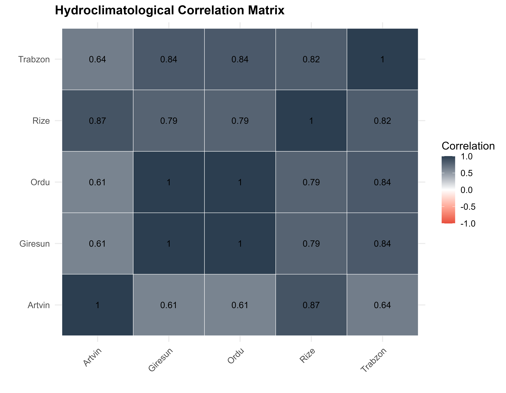
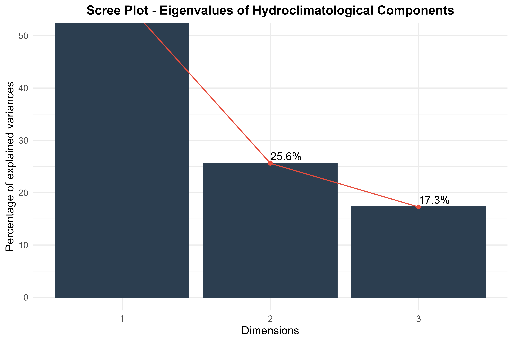
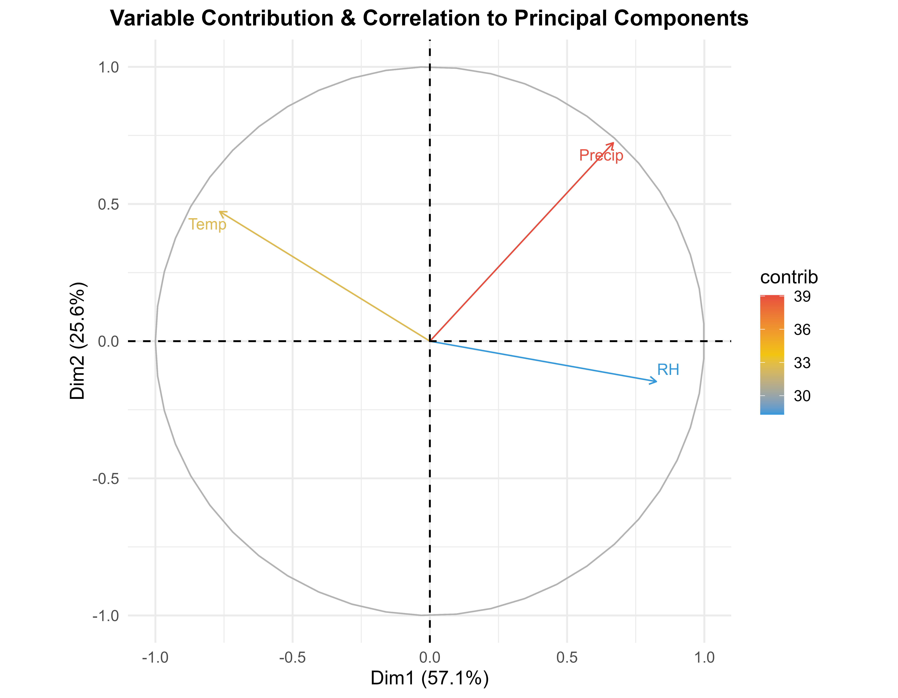
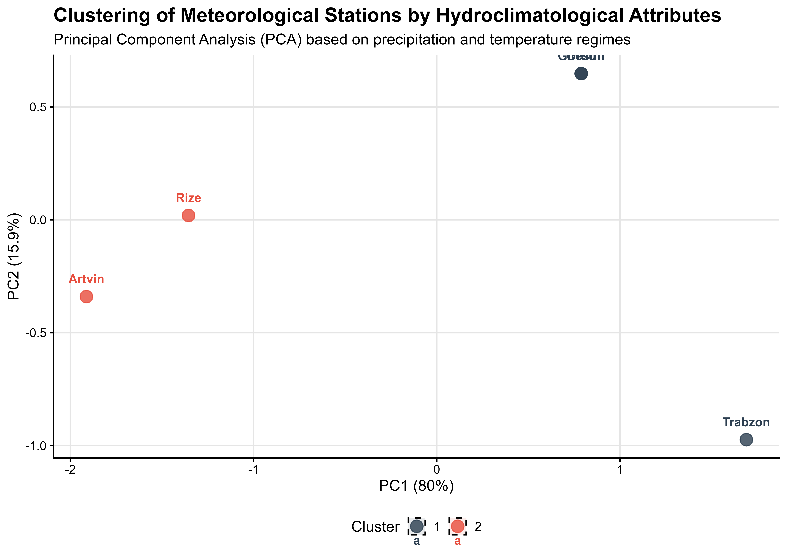
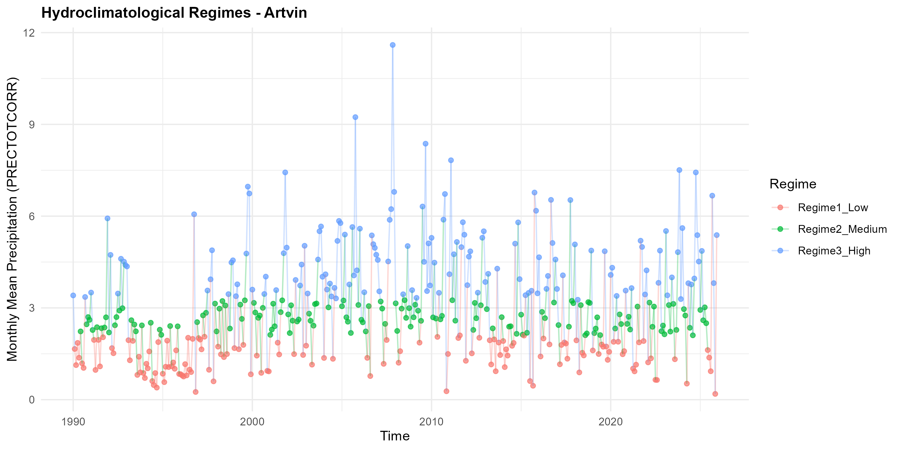
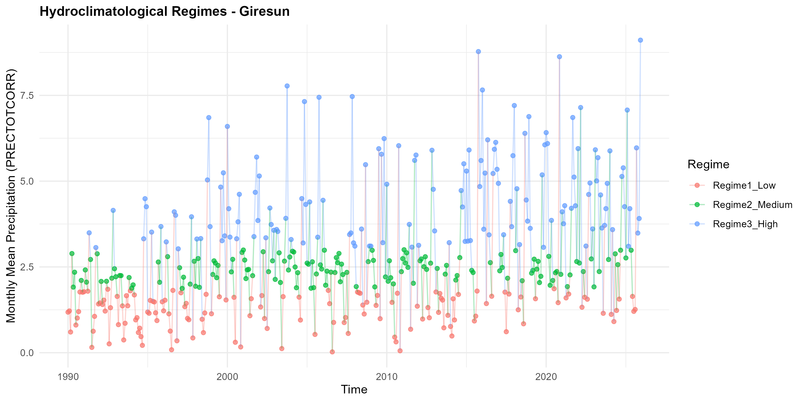
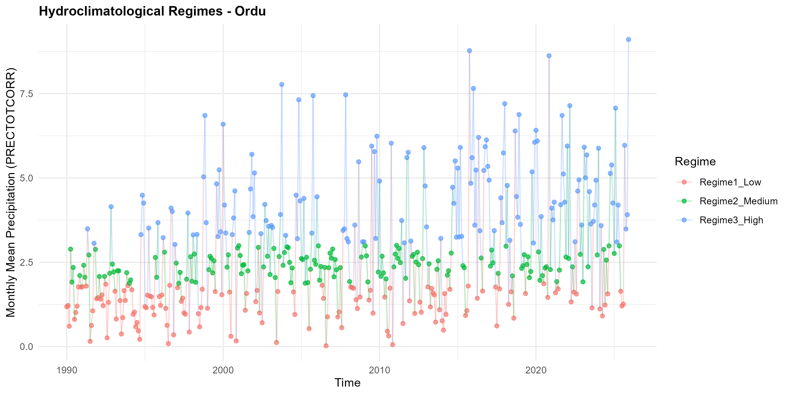
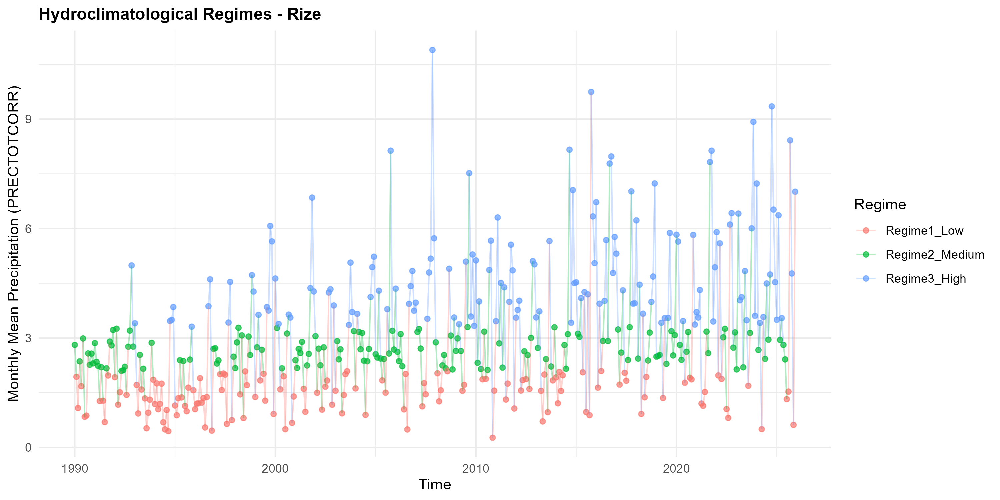
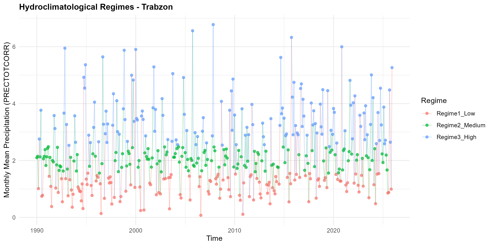

# Changing Hydroclimatic Regimes and Extreme Precipitation Dynamics in the Eastern Black Sea Region of Türkiye

### An Integrated NASA POWER-Based Hydroclimatic, Extreme Precipitation, Time-Frequency and Regime Analysis

**Author:** Ahmet Solmaz
**Study Region:** Eastern Black Sea Region, Türkiye
**Data Source:** NASA Prediction of Worldwide Energy Resources (NASA POWER)
**Programming Environment:** R
**Study Period:** 1990–2025
**Research Domains:** Hydroclimatology · Climate Variability · Extreme Precipitation · Climate Statistics · Time-Series Analysis · Extreme Value Theory · Climate Regime Detection

---

## Abstract

The Eastern Black Sea Region of Türkiye represents one of the country's most complex hydroclimatic environments, characterized by high precipitation totals, strong seasonality, pronounced topographic controls, elevated atmospheric moisture, and frequent high-intensity precipitation events.

This project, independently developed by **Ahmet Solmaz**, investigates the changing hydroclimatic structure and extreme precipitation dynamics of the Eastern Black Sea Region using daily meteorological data obtained from the **NASA POWER** database for the period 1990–2025.

Rather than evaluating climate change exclusively through changes in mean precipitation, the study adopts a multidimensional statistical framework designed to investigate changes in precipitation intensity, frequency, persistence, distributional structure, hydroclimatic moisture balance, temporal periodicity, structural breaks, extreme-event probability, and statistical regime behavior.

The analytical framework integrates hydroclimatic indices, precipitation-extreme indicators, modified Mann–Kendall trend analysis, Sen's slope estimation, Pettitt change-point detection, PELT segmentation, quantile regression, Extreme Value Theory (EVT), GEV/GPD/POT approaches, wavelet analysis, wavelet coherence, principal component analysis (PCA), clustering, correlation analysis, and multivariate regime identification.

The central scientific premise is that a hydroclimatic system may undergo substantial structural changes even when changes in its long-term mean are relatively modest. Consequently, the project places particular emphasis on the **upper tail of the precipitation distribution, abrupt structural transitions, temporal-scale dependence, and shifts between hydroclimatic regimes**.

---

# 1. Research Motivation

The Eastern Black Sea Region is frequently described as one of the wettest environments in Türkiye. However, high climatological precipitation does not imply a temporally or statistically stationary hydroclimatic regime.

A changing climate may simultaneously modify:

* precipitation intensity,
* frequency of heavy precipitation,
* duration of wet and dry periods,
* atmospheric moisture conditions,
* evaporative demand,
* drought characteristics,
* precipitation distribution tails,
* temporal persistence,
* periodic behavior,
* and the probability of rare extreme events.

Therefore, a conventional linear trend analysis is insufficient to describe the complete evolution of the regional hydroclimatic system.

This project addresses this limitation by combining **trend, distributional, change-point, extreme-value, time-frequency, multivariate and regime-based statistical approaches** within a unified framework.

---

# 2. Main Research Questions

The project addresses the following questions:

### RQ1 — Long-Term Hydroclimatic Change

Have annual and seasonal hydroclimatic conditions changed systematically during 1990–2025?

### RQ2 — Extreme Precipitation

Have heavy and extreme precipitation events changed in frequency, magnitude or persistence?

### RQ3 — Distributional Change

Are changes concentrated in the upper and lower portions of the precipitation distribution rather than in the mean alone?

### RQ4 — Structural Breaks

Have statistically identifiable shifts occurred within the regional hydroclimatic time series?

### RQ5 — Temporal Dependence

Do precipitation and atmospheric variables exhibit statistically meaningful periodicities at different temporal scales?

### RQ6 — Moisture Balance

Has the regional moisture balance changed despite the generally humid character of the Eastern Black Sea climate?

### RQ7 — Hydroclimatic Regimes

Can the observed climate variability be represented by distinct statistical regimes?

### RQ8 — Regime Persistence

How persistent are individual regimes and how frequently does the system transition between them?

### RQ9 — Spatial Differentiation

Do stations located in different hydroclimatic settings exhibit different precipitation and extreme-event characteristics?

### RQ10 — Tail Risk

Has the statistical probability of rare precipitation events changed through time?

---

# 3. Data and Study Design

The analysis uses daily meteorological information derived from NASA POWER for the Eastern Black Sea Region.

The study period covers:

**1990–2025**

The analysis is designed to capture both:

* long-term hydroclimatic variability,
* and high-frequency extreme precipitation behavior.

The workflow transforms the daily data into the temporal structures required for individual statistical analyses, including annual, seasonal, monthly and event-based indicators.

---

# 4. Statistical Framework

The project is deliberately designed as an integrated statistical framework rather than a collection of independent analyses.

The analytical sequence is:

```text
NASA POWER Daily Meteorological Data
                ↓
        Data Quality Control
                ↓
       Temporal Aggregation
                ↓
     Hydroclimatic Indicators
                ↓
   Precipitation Extreme Indices
                ↓
        SPI / SPEI / PET
                ↓
    Trend and Monotonicity Tests
                ↓
       Modified Mann–Kendall
                ↓
          Sen's Slope
                ↓
        Pettitt Test
                ↓
       PELT Segmentation
                ↓
       Quantile Regression
                ↓
    Extreme Value Theory
                ↓
       GEV / GPD / POT
                ↓
        Wavelet Analysis
                ↓
       Wavelet Coherence
                ↓
       PCA / Clustering
                ↓
   Multivariate Regime Analysis
                ↓
 Hydroclimatic Regime Interpretation
```

This structure allows the project to move from simple temporal changes toward increasingly complex questions concerning **distributional change, non-stationarity, periodicity and regime transitions**.

---

# 5. Hydroclimatic Indicators

The first analytical layer evaluates the fundamental hydroclimatic state of the region.

The project investigates:

* precipitation variability,
* precipitation anomalies,
* drought characteristics,
* atmospheric moisture,
* potential evapotranspiration,
* moisture balance,
* and hydroclimatic indices.

The corresponding results are stored in:

* `East_BlackSea_Drought_Aridity_Indices.xlsx`
* `East_BlackSea_Precipitation_Indices.xlsx`
* `East_BlackSea_Master_Analysis.xlsx`

These outputs provide the baseline required for interpreting subsequent extreme-event and regime analyses.

---

# 6. Drought, Aridity and Moisture-Balance Analysis

The project does not treat precipitation independently from atmospheric demand.

Hydroclimatic conditions are evaluated through indicators including:

* SPI,
* SPEI,
* PET,
* precipitation-based indices,
* aridity-related indicators,
* and moisture-balance variables.

This is particularly important for the Eastern Black Sea Region because a precipitation-rich climate can still experience changes in effective moisture availability when atmospheric demand and temperature conditions evolve.

The analysis therefore distinguishes between:

**precipitation availability**

and

**effective hydroclimatic moisture conditions**.

This distinction provides a stronger basis for understanding climate-system restructuring than precipitation totals alone.

---

# 7. Extreme Precipitation Analysis

A major component of the study is the analysis of precipitation extremes using internationally established precipitation-extreme concepts.

The project evaluates changes in indicators associated with:

* heavy precipitation,
* extreme precipitation,
* precipitation intensity,
* wet-day behavior,
* consecutive precipitation characteristics,
* and the statistical tails of the precipitation distribution.

The principal output is:

`East_BlackSea_ETCCDI_Extremes.xlsx`

The resulting analysis is designed to answer an important question:

> Is the hydroclimatic change occurring primarily in average precipitation, or is the precipitation distribution itself becoming more extreme?

This distinction is central to climate-risk assessment because changes in extreme precipitation may have substantially greater environmental and societal consequences than changes in long-term mean precipitation.

---

# 8. Trend Analysis

Long-term trends are investigated using non-parametric statistical methods.

### Modified Mann–Kendall Test

The Modified Mann–Kendall framework is used to identify monotonic temporal trends while accounting for temporal dependence where appropriate.

### Sen's Slope

Sen's slope provides a robust estimate of the magnitude and direction of detected trends.

Together, these methods allow the analysis to distinguish:

* increasing trends,
* decreasing trends,
* statistically weak trends,
* and trend magnitude.

The corresponding results are compiled in:

`East_BlackSea_Trend_Analysis_Results.xlsx`

The purpose is not simply to determine whether precipitation increased or decreased, but to establish **which hydroclimatic characteristics exhibit systematic temporal evolution and how strong those changes are**.

---

# 9. Pettitt Change-Point Analysis

Trend analysis alone assumes a relatively continuous temporal structure.

The Pettitt test addresses a different question:

> Did the statistical behavior of the series change abruptly at a particular point in time?

The results are stored in:

`East_BlackSea_Pettitt_Test_Results.xlsx`

Change-point analysis is particularly important because a climate series may contain multiple periods with different statistical characteristics.

Consequently, a single trend estimated over the complete period may conceal substantial internal structural changes.

---

# 10. PELT Change-Point Detection

To complement the Pettitt test, the project applies **PELT (Pruned Exact Linear Time)** change-point analysis.

PELT provides a more flexible segmentation framework capable of identifying multiple structural changes within a time series.

Results are stored in:

`East_BlackSea_PELT_Change_Points.xlsx`

The combined Pettitt–PELT framework strengthens the structural-break analysis by allowing the project to investigate both:

* individual statistically dominant change points,
* and multiple potential regime boundaries.

This is an important methodological step toward identifying **hydroclimatic regime transitions rather than merely long-term trends**.

---

# 11. Quantile Regression

One of the most important methodological components of the project is **quantile regression**.

Conventional linear regression estimates changes in the conditional mean.

However, climate change may affect different parts of a distribution differently.

For this reason, the analysis evaluates changes across different quantiles of precipitation behavior.

Conceptually:

```text
Lower Quantiles
      ↓
Central Distribution
      ↓
Upper Quantiles
      ↓
Extreme Tail
```

This allows the study to investigate whether temporal changes are:

* approximately uniform across the distribution,
* concentrated around the median,
* or amplified toward the upper precipitation tail.

Results are stored in:

`East_BlackSea_Quantile_Regression.xlsx`

This component provides a direct statistical framework for evaluating whether **extreme precipitation is evolving differently from ordinary precipitation**.

---

# 12. Extreme Value Theory

Extreme Value Theory constitutes one of the most advanced components of the project.

The analysis uses:

### Generalized Extreme Value Distribution — GEV

The GEV framework is used to characterize block maxima and the statistical behavior of extreme precipitation.

### Generalized Pareto Distribution — GPD

The GPD framework is used for threshold-exceedance analysis.

### Peaks Over Threshold — POT

The POT framework focuses specifically on precipitation events exceeding statistically defined thresholds.

The corresponding results are stored in:

`East_BlackSea_EVT_Results.xlsx`

This framework shifts the research question from:

> "How has average precipitation changed?"

toward:

> "How has the probability structure of rare precipitation events changed?"

This distinction substantially increases the relevance of the analysis for hydrological risk, flood hazard assessment and climate adaptation.

---

# 13. Wavelet Analysis

Climate variability is inherently multiscale.

A precipitation series may simultaneously contain:

* short-term variability,
* seasonal oscillations,
* interannual variability,
* multi-year periodicities,
* and non-stationary oscillations.

Wavelet analysis is therefore used to identify temporal-frequency structures that conventional trend methods cannot detect.

The corresponding output is:

`East_BlackSea_Wavelet_Analysis.xlsx`

The wavelet framework investigates:

* dominant periodicities,
* temporal localization of oscillations,
* changes in periodic behavior,
* and non-stationary variability.

---

# 14. Wavelet Coherence

Wavelet coherence extends the analysis by investigating the time-frequency relationship between hydroclimatic variables.

This allows the project to investigate whether relationships such as:

```text
Temperature ↔ Precipitation
Humidity ↔ Precipitation
PET ↔ Precipitation
SPI ↔ SPEI
```

remain stable through time or vary across temporal scales.

This is particularly important because a strong correlation at an annual scale does not necessarily imply the same relationship at seasonal or interannual scales.

---

# 15. Correlation Structure

The project applies multiple correlation frameworks:

* Pearson correlation,
* Spearman rank correlation,
* Kendall's tau.

The correlation analysis evaluates relationships among:

* temperature,
* precipitation,
* humidity,
* PET,
* SPI,
* SPEI.

The results are supported by:

`Station_Correlation_Analysis.xlsx`

and the publication-quality visualization:

`Academic_Correlation_Heatmap.png`

### Academic Correlation Heatmap



The correlation structure provides an initial assessment of hydroclimatic dependence before the application of more advanced multivariate and time-frequency approaches.

---

# 16. Principal Component Analysis

Principal Component Analysis (PCA) is used to reduce the dimensionality of the hydroclimatic system and identify the dominant modes of variability.

The principal output is:

`Hydroclimatological_PCA_Analysis.xlsx`

Two major graphical outputs are included:

### PCA Scree Plot



The scree plot evaluates the relative contribution of successive principal components and identifies the dominant dimensions of hydroclimatic variability.

### PCA Variable Biplot



The variable biplot provides an interpretable representation of the relationships among hydroclimatic variables and their contribution to the principal components.

Together, these analyses help identify the variables that most strongly structure the regional hydroclimatic system.

---

# 17. Station Clustering

The project also evaluates similarities and differences among locations using clustering-based approaches.

The main outputs include:

`Station_Clustering_Report.xlsx`

and:

`Publication_Quality_Clustering.png`

### Station Clustering



The clustering framework is particularly useful for determining whether stations can be grouped according to similar hydroclimatic behavior.

This provides an empirical basis for distinguishing potential:

* coastal regimes,
* inland regimes,
* humid regimes,
* transitional regimes,
* and extreme-precipitation-sensitive station groups.

---

# 18. Multivariate Hydroclimatic Regime Analysis

The central conceptual contribution of the project is the transition from individual-variable analysis toward **multivariate hydroclimatic regime identification**.

The project combines multiple indicators to characterize statistically distinguishable hydroclimatic states.

The principal output is:

`Analysis_24_Multivariate_Regime_Results.xlsx`

The framework is designed to investigate whether the regional hydroclimatic system can be represented by different states characterized by combinations of:

* precipitation,
* atmospheric moisture,
* drought,
* evaporative demand,
* extreme precipitation,
* and temporal variability.

This represents a substantial conceptual shift from traditional trend analysis.

---

# 19. Station-Level Regime Visualizations

The project includes publication-oriented regime figures for several major stations.

## Artvin



## Giresun



## Ordu



## Rize



## Trabzon



These station-level visualizations provide a direct representation of temporal changes in hydroclimatic states and allow comparisons among different parts of the Eastern Black Sea Region.

---

# 20. Regime Interpretation

The regime framework is not intended simply to classify individual years.

Its purpose is to identify whether the hydroclimatic system exhibits:

* persistent states,
* recurrent states,
* transitional periods,
* abrupt shifts,
* periods of enhanced precipitation activity,
* periods of reduced hydroclimatic moisture,
* and changes in the frequency or duration of particular states.

The regime perspective therefore complements both the change-point and extreme-value analyses.

---

# 21. Integrated Results

The major strength of this project is the convergence of several independent statistical perspectives.

The results are organized around six major dimensions.

### 21.1 Trend Dimension

Mann–Kendall and Sen's slope identify long-term directional changes.

### 21.2 Structural Dimension

Pettitt and PELT identify abrupt and potentially multiple structural changes.

### 21.3 Distributional Dimension

Quantile regression evaluates whether changes differ across the precipitation distribution.

### 21.4 Extreme-Value Dimension

GEV, GPD and POT investigate the statistical behavior of rare precipitation events.

### 21.5 Time-Frequency Dimension

Wavelet and wavelet coherence analyses identify non-stationary periodicities and scale-dependent relationships.

### 21.6 Regime Dimension

PCA, clustering and multivariate regime analysis identify changes in the underlying hydroclimatic structure.

The convergence of these dimensions provides a substantially more comprehensive interpretation than any individual method could provide independently.

---

# 22. Main Scientific Findings

The complete results should be interpreted as a **structural assessment of hydroclimatic change**, rather than as a simple precipitation trend study.

The analysis demonstrates the importance of examining:

* precipitation intensity rather than totals alone,
* extreme-event frequency rather than averages alone,
* distributional tails rather than only the mean,
* structural breaks rather than assuming stationarity,
* periodicity rather than assuming purely stochastic variability,
* and regime persistence rather than treating every year as statistically equivalent.

The combined analyses indicate that hydroclimatic variability in the Eastern Black Sea Region should be interpreted as a **multidimensional and potentially non-stationary system**.

The extreme precipitation component is especially important because changes in the upper tail may imply increasing hydrological risk even where the long-term average precipitation signal is comparatively weak or heterogeneous.

The quantile-based framework further allows the study to distinguish ordinary precipitation behavior from changes occurring at higher precipitation quantiles.

The change-point analyses provide evidence for examining the climate record as a sequence of statistically different periods rather than a single homogeneous population.

The wavelet analyses add another dimension by demonstrating that precipitation variability may operate at multiple temporal scales and that these relationships may not remain constant throughout the study period.

Finally, PCA, clustering and regime analysis provide a system-level interpretation by showing how multiple hydroclimatic indicators can be combined to identify distinct statistical states.

---

# 23. Why This Framework Matters

A conventional hydroclimatic study might ask:

> "Is precipitation increasing or decreasing?"

This project asks a broader set of questions:

> **Is the precipitation distribution changing?**

> **Are extreme events becoming statistically different?**

> **Are structural breaks occurring?**

> **Are changes concentrated in the upper tail?**

> **Are temporal periodicities changing?**

> **Are hydroclimatic variables becoming differently coupled?**

> **Is the system moving between distinct statistical regimes?**

This distinction represents the principal methodological contribution of the project.

---

# 24. Complete Results Repository

The repository contains structured numerical outputs supporting the analysis:

| Result File                                    | Analytical Component             |
| ---------------------------------------------- | -------------------------------- |
| `East_BlackSea_Master_Analysis.xlsx`           | Integrated master results        |
| `East_BlackSea_Drought_Aridity_Indices.xlsx`   | Drought and aridity indicators   |
| `East_BlackSea_Precipitation_Indices.xlsx`     | Precipitation indices            |
| `East_BlackSea_ETCCDI_Extremes.xlsx`           | Extreme precipitation indicators |
| `East_BlackSea_Trend_Analysis_Results.xlsx`    | Trend analysis                   |
| `East_BlackSea_Pettitt_Test_Results.xlsx`      | Pettitt change-point results     |
| `East_BlackSea_PELT_Change_Points.xlsx`        | PELT segmentation                |
| `East_BlackSea_Quantile_Regression.xlsx`       | Quantile regression              |
| `East_BlackSea_EVT_Results.xlsx`               | Extreme Value Theory             |
| `East_BlackSea_Wavelet_Analysis.xlsx`          | Wavelet analysis                 |
| `Hydroclimatological_PCA_Analysis.xlsx`        | PCA results                      |
| `Analysis_24_Multivariate_Regime_Results.xlsx` | Multivariate regimes             |
| `East_BlackSea_Regime_Analysis_R.xlsx`         | Regime analysis                  |
| `Station_Correlation_Analysis.xlsx`            | Station correlations             |
| `Station_Clustering_Report.xlsx`               | Station clustering               |

---

# 25. Complete Graphical Evidence

The repository includes publication-oriented visualizations supporting the statistical analyses.

### Correlation Structure


### PCA Scree Structure


### PCA Variable Structure


### Clustering Structure


### Artvin Regimes


### Giresun Regimes


### Ordu Regimes


### Rize Regimes


### Trabzon Regimes


---

# 26. Methodological Contribution

The project integrates several methodological traditions that are often applied independently:

```text
Non-parametric Statistics
        +
Change-Point Detection
        +
Quantile Regression
        +
Extreme Value Theory
        +
Wavelet Analysis
        +
Multivariate Statistics
        +
Clustering
        +
Regime Analysis
```

This integration creates a more comprehensive framework for studying **non-stationary hydroclimatic variability and precipitation extremes**.

The methodological architecture is particularly appropriate for regions where:

* precipitation is strongly heterogeneous,
* topography influences atmospheric processes,
* extreme precipitation is important,
* and climate variability cannot be adequately represented by a single linear trend.

---

# 27. Reproducibility

All statistical analyses are implemented in **R**.

The project follows a reproducible research structure:

```text
Raw Data
   ↓
Quality Control
   ↓
Data Processing
   ↓
Indicator Calculation
   ↓
Statistical Analysis
   ↓
Numerical Results
   ↓
Visualization
   ↓
Scientific Interpretation
```

The repository contains:

* R scripts,
* processed analytical outputs,
* Excel result tables,
* high-resolution figures,
* station-level regime visualizations,
* and methodological documentation.

Every major result is intended to be traceable from the original data-processing stage through statistical estimation and graphical representation.

---

# 28. Scientific Scope

This research contributes to the following fields:

* Hydroclimatology
* Climate Variability
* Climate Change Assessment
* Extreme Precipitation Analysis
* Extreme Value Theory
* Climate Statistics
* Time-Series Analysis
* Non-Parametric Statistics
* Quantile Regression
* Wavelet Analysis
* Multivariate Statistics
* Climate Regime Detection
* Drought and Aridity Analysis
* Atmospheric Moisture Dynamics
* Hydrological Risk Assessment

---

# 29. Potential Applications

The analytical framework can support future research concerning:

* extreme precipitation risk,
* flood hazard assessment,
* climate adaptation,
* water-resource management,
* infrastructure planning,
* regional climate-risk assessment,
* hydroclimatic monitoring,
* disaster-risk reduction,
* and environmental impact assessment.

The regime-based framework may also provide a useful basis for future studies involving climate projections and non-stationary risk assessment.

---

# 30. Limitations and Research Status

This repository represents an ongoing research and analytical development project.

The numerical outputs and visualizations currently available in the repository are being progressively integrated and validated. Consequently, individual statistical results should be interpreted within the context of the current analytical version.

Future development will focus on:

* final statistical validation,
* consistency checks among independent methods,
* integrated interpretation of change points,
* refinement of extreme-value models,
* further validation of regime classification,
* and consolidation of the final scientific results.

---

# 31. Author

## Ahmet Solmaz

**Geography · Climatology · Hydroclimatology · Climate Data Analysis · R Statistical Computing**

This project was independently developed and prepared by **Ahmet Solmaz**.

The research reflects an integrated approach to hydroclimatic data analysis, combining statistical climatology, extreme-event analysis, time-series methods, multivariate statistics and climate-regime detection.

---

# 32. Project Structure

```text
Changing-Hydroclimatic-Regimes-and-Extreme-Precipitation-Dynamics/
│
├── R/
│   ├── 1. Code.R
│   ├── 2. Code.R
│   ├── 3. Code.R
│   ├── 4. Code.R
│   ├── 5. Code.R
│   ├── 6. Code.R
│   ├── 7. Code.R
│   ├── 8. Code.R
│   ├── 9. Code.R
│   ├── 10. Code.R
│   ├── 11. Code.R
│   ├── 12. Code.R
│   ├── 13. Code.R
│   └── 14. Code.R
│
├── Results/
│   ├── Trend Analysis
│   ├── Change Points
│   ├── Extreme Value Theory
│   ├── Quantile Regression
│   ├── Wavelet Analysis
│   ├── PCA
│   ├── Clustering
│   └── Regime Analysis
│
├── Figures/
│   ├── Correlation
│   ├── PCA
│   ├── Clustering
│   └── Station Regimes
│
├── Excel Outputs/
│   ├── Hydroclimatic Indices
│   ├── Extreme Precipitation
│   ├── EVT
│   ├── PELT
│   ├── Pettitt
│   ├── Quantile Regression
│   ├── Wavelet
│   ├── PCA
│   └── Regime Analysis
│
└── README.md
```

---

# 33. Conclusion

This project presents an integrated statistical investigation of changing hydroclimatic regimes and extreme precipitation dynamics in the Eastern Black Sea Region of Türkiye.

The principal methodological strength lies in combining **trend detection, structural-break analysis, distributional analysis, extreme-value statistics, time-frequency analysis, dimensionality reduction, clustering and regime identification**.

The resulting framework moves beyond the conventional interpretation of climate change as a simple increase or decrease in average precipitation.

Instead, it considers the hydroclimatic system as a potentially **non-stationary, multiscale and regime-dependent system** in which the frequency, intensity, persistence, distribution and probability of extreme events may evolve differently through time.

Accordingly, the project provides a comprehensive statistical foundation for understanding how hydroclimatic variability and extreme precipitation behavior are changing across one of Türkiye's most precipitation-sensitive regions.

---

# Keywords

`Eastern Black Sea`
`Türkiye`
`NASA POWER`
`Hydroclimatology`
`Extreme Precipitation`
`Climate Variability`
`Climate Change`
`Mann-Kendall`
`Sen's Slope`
`Pettitt Test`
`PELT`
`Quantile Regression`
`Extreme Value Theory`
`GEV`
`GPD`
`POT`
`Wavelet Analysis`
`Wavelet Coherence`
`PCA`
`Clustering`
`Markov Switching`
`Hydroclimatic Regimes`
`SPI`
`SPEI`
`PET`
`R Programming`
`Time-Series Analysis`

---

## Citation

If this repository or its analytical framework is used in academic research, please acknowledge:

**Solmaz, A. — Changing Hydroclimatic Regimes and Extreme Precipitation Dynamics in the Eastern Black Sea Region of Türkiye.**

---

### Researcher

**Ahmet Solmaz**

*Independent Research Project — Hydroclimatology, Climate Statistics and Extreme Precipitation Analysis*
